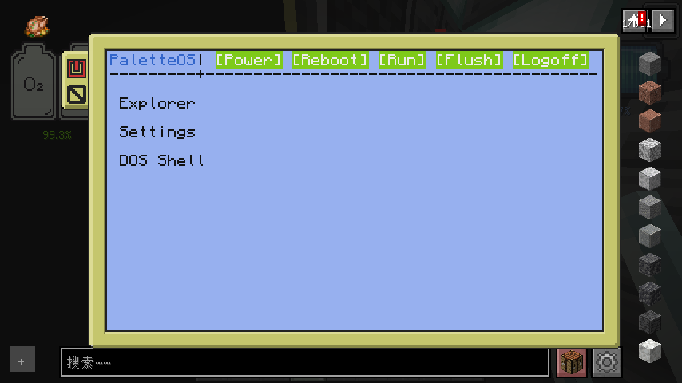

<picture>
  <source media="(prefers-color-scheme: dark)" srcset="./icon_bright.png">
  <source media="(prefers-color-scheme: light)" srcset="./icon.png">
  
</picture>


**Palette OS** is a Operating System on [CC Tweaked](https://github.com/cc-tweaked/CC-Tweaked), a mod on Minecraft.
It is special because it has GUI, and the core of our GUI, Palette UI, is always welcome for use. We're glad to see more developers to make more amazing UI apps on **Palette OS**.

## Screenshots


*Login Page*


*Classic Theme*



*Aqua Theme*


*Pinky Theme*


*Settings*


*File Explorer*


## Install
To be able to install **Palette OS**, you need the zip file of a specific version. 
Notice that the `installation.lua` file in the release is only available before the next version has updated on github.

After getting the zip file, often named as `[version] [version code].zip`, you need to unpack it in the `/` directory, or the home directory. Then restart your computer, if you see the setup page, **Palette OS** has successfully installed in your computer.

## Palette UI (API)
We opened the api for every developers, to use it in your project or app, you need to `require` it

```lua
require("system/paletteUI_api")
--codes are written beneath that
```
*Notice: Sometimes files move around, if it occurs, this README will also update.*
